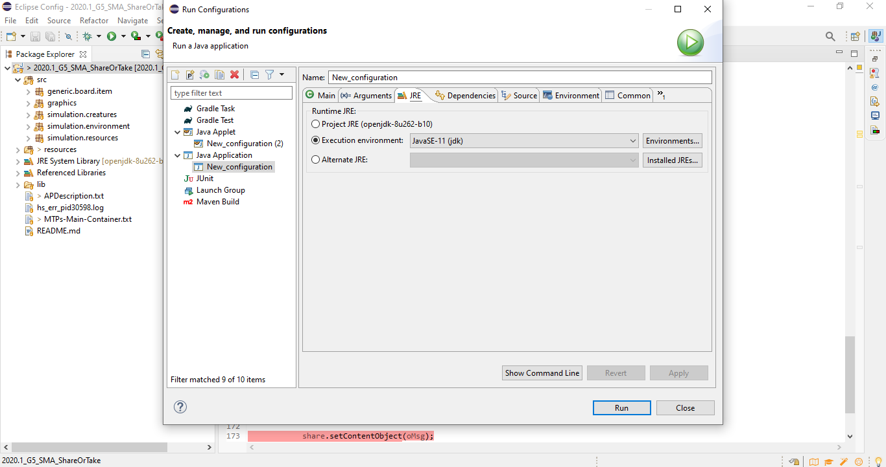

# "Share Or Take?"

**Disciplina**: FGA0210 - PARADIGMAS DE PROGRAMAÇÃO - T01  
**Nro do Grupo**: 05  
**Paradigma**: SMA

## Alunos

|Matrícula | Aluno |
| -- | -- |
| 16/0049458 | Eduardo Lima Ribeiro |
| 17/0070735  |  Lucas Maciel Aguiar |

## Sobre

Esse projeto consiste em uma simulação simples para demonstrar a aplicabilidade de Sistemas MultiAgentes a partir de uma simulação de sobrevivência de uma comunidade com espécies distintas compartilhando o mesmo recursos, porém cada espécie possui sua própria estratégia de sobrevivência.  

## Screenshots

## Instalação

**Linguagens**: Java  
**Tecnologias**: JADE, JFrame  

Descreva os pré-requisitos para rodar o seu projeto e os comandos necessários.
Insira um manual ou um script para auxiliar ainda mais.

## Uso

Certifique-se que tenha JRE 11, Eclipse ou um IDE Java equivalente, JADE e JFrame instalados.

Defina a classe principal como jade.Boot.

Adicione o argumento
~~~
-gui environment:simulation.environment.EnvironmentAgent
~~~

Certifique-se de que JRE 11 esteja selecionado para o projeto.

Configure a simulação como desejar, e clique em iniciar!

## Vídeo

https://youtu.be/pDlHvPBiERk

## Fontes

__Simulação de compartilhamento de recursos em uma comunidade heterogênea:__ <https://www.youtube.com/watch?v=YNMkADpvO4w&t=685s&ab_channel=Primer>
__Exemplo de Party JADE__: <https://jade.tilab.com/documentation/examples/party/>